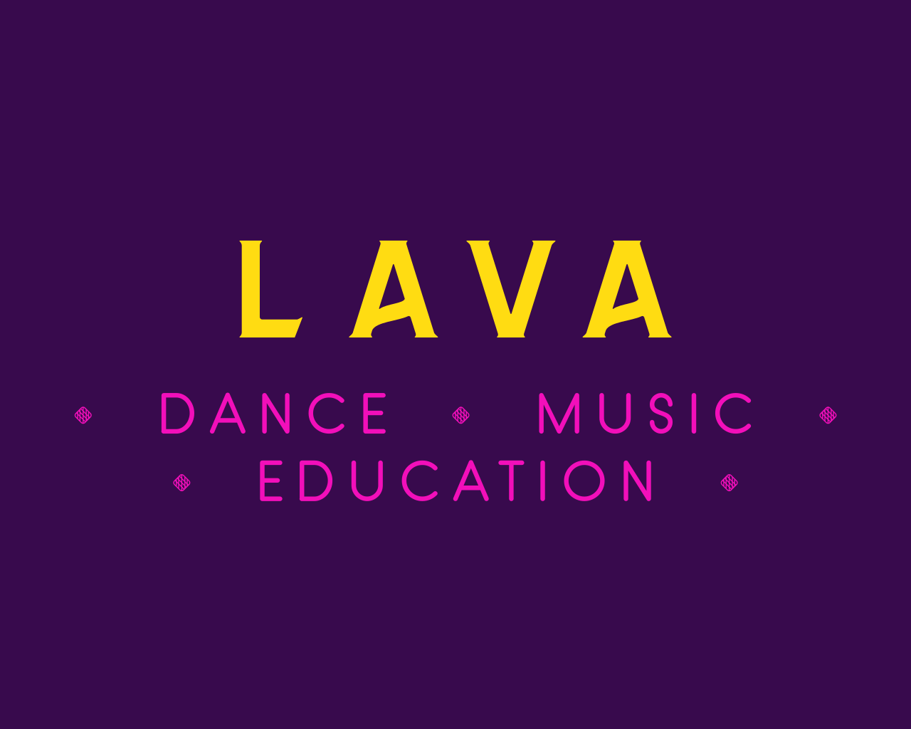

<a href="https://ElenLen.github.io/LavaStudio/">Перейти по ссылке</a>

---

## Description

**A responsive and adaptive** landing page for a creative studio.

This is an educational project made by students of the #itgirlsschool.

## About the project

Veggieboost implemented on Sass preprocessor. In the project were used the following technologies:

- Flexbox
- CSS Grid Layout

The project has animation for hovering the cursor over buttons and product cards.

Also it has working navigation through page sections.

